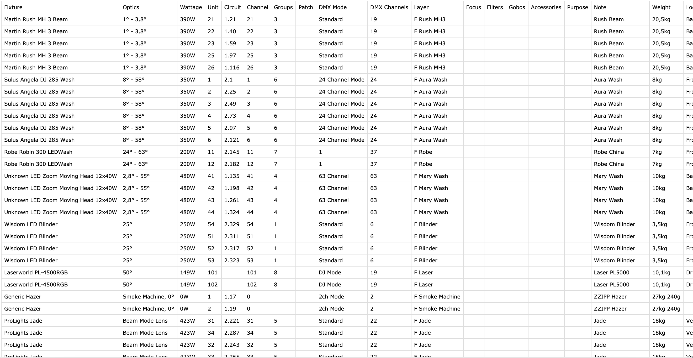

# Capture Patcher Tool

Do you find yourself in a situation where you have a rig with multiple universes but only a Capture Solo license? While you can design your project in the Solo edition, you're restricted to patching just one universe of fixtures.

You might consider using Capture Demo, but there's a catch. With the Demo, you're limited to 90 minutes of previz before it ends, and within this time frame, you must patch all the fixtures.

Introducing my tool: easily edit the CSV fixture data file exported from Solo and import it into Capture Demo, saving valuable time.

## How It Works:

1. Draw your project as usual in Capture Solo (without adding the patch).
2. Export the Fixture Data file into CSV format from the export menu.
   - Optionally, export the project for a different version of Capture to use the Demo without removing your license.
3. Open the terminal in the folder where the file is located and use the script to add patch information.
4. Open the project in Capture Demo and effortlessly import the new Fixture Data file with all the patches.

Enjoy the convenience! Patch all your fixtures in a flash without wasting any time. And when the 90 minutes are up, simply close, reopen, and reimport the file.

## Modes Explanation

First of all let's analyze a CSV file exported from Capture. These are the field where this script works on:
1. Fixture: this is the name of the fixture in the Capture library. **Do not change that** The script use this field to group fixture, so let you choose a fixture type and sequentially patch all fixture inside that "family"
2. Circuit: this is the place you can enter an electric circuit. We'll use this field to write down (manually or with Capture sequential tool) the dmx addresses of the fixture. Capture Solo/Duet/Quartet let's you patch only a fixed amount of universes based on your licence, this way **you can bypass this limit** and write whatever address you want inside the circuit field. 
3. Patch: this is the real dmx address used by Capture. The script makes the hard work for you, dynamically populating this field according the desidered mode 
4. Note: this is a multi purpose field, you can enter anything here. Although you can use this field to give fixture types a custom name, or a brief one (sometimes Capture fixture names are really annoying). The script asks you if you want to use custom names for fixtures, and if you select "yes" Note field is loaded instead default Fixture field.

Here there is a sample Capture CSV file

### 1. Patch by Fixture name [EDIT PATCH FIELD]
In this mode you can choose (either via Fixture default names or custom names) a fixture family, and then sequentially patch his istances. Simply select the desidered fixture, then type start address, start channel and voilà. If the fixture channels overflow the selected universe, patching will continue to the next universe.
The calculated dmx addresses will be written down in the Patch field of the output CSV file.

### 2. Patch by Fixture name [EDIT CIRCUIT FIELD]
Same as mode 1, with the difference that the dmx addresses are writed in the Circuit field instead of patch field. This is more an utility mode.

### 3. Patch entire file [EDIT PATCH FIELD]
As the name suggests, all the fixture in the file will be patched starting from the selected start universe and start channel. The dmx address is written in Patch field of the output CSV file.

### 4. Patch entire file [EDIT CIRCUIT FIELD]
Same as mode 3 but the dmx address is written in Circuit field. This is more an utility mode.

### 5. Copy Circuit field to Patch field
This is the most used mode. It copies the Circuit field to the Patch field of the output CSV file. 
This way you can manually, or automatically, write down dmx addresses in Circuit field, and then copy to the Patch one without any effort.

### 6. Clear all Patch fields & 7. Clear all Circuit fields
Utility modes. The name is self explanatory.

### Exit
Don't think i have to explain this

